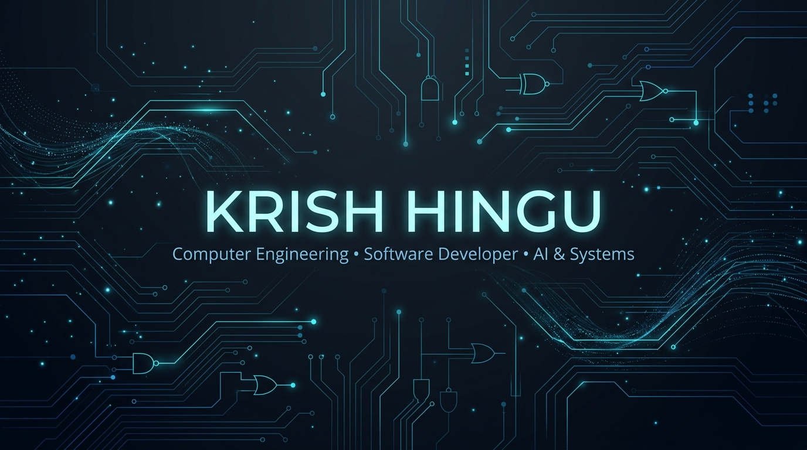

<div align="center">
  <a href="https://github.com/CodeWidKrish">
    
  </a>
</div>

<hr/>

<div align="center">
  <a href="https://github.com/CodeWidKrish">
    
  </a>
</div>

<hr/>

### 👨‍💻 About Me

🎓 Final-year Computer Engineering @ SVKM's Bhagubhai Mafatlal Polytechnic, Mumbai  
🔨 Currently building TradeVision AI — algorithmic stock intelligence app  
🌍 Speaks: English · Hindi · Gujarati · Marathi · German  

<hr/>

### 🚧 Currently Building

> 🚧 **TradeVision AI** — Real-time candlestick charting, FastAPI microservices, ML price forecasting, Supabase cloud sync. `[Flutter · Python · Supabase · Scikit-Learn]`

<hr/>

### 📊 GitHub Stats

<div align="center">
  <table border="0" width="100%">
    <tr valign="top">
      <td width="50%" align="center">
        <a href="https://github.com/CodeWidKrish">
          
        </a>
      </td>
      <td width="50%" align="center">
        <a href="https://github.com/CodeWidKrish">
          
        </a>
      </td>
    </tr>
  </table>
  <br/>
  <a href="https://github.com/CodeWidKrish">
    
  </a>
</div>

<hr/>

### 🛠️ Skills

<div align="center">
  <table border="0" width="100%">
    <thead>
      <tr>
        <th align="center" width="33%">Mobile & Backend</th>
        <th align="center" width="33%">Data & ML</th>
        <th align="center" width="34%">Tools & DB</th>
      </tr>
    </thead>
    <tbody align="center">
      <tr>
        <td>
          <a href="https://flutter.dev/" target="_blank"></a><br/><br/>
          <a href="https://dart.dev/" target="_blank"></a><br/><br/>
          <a href="https://fastapi.tiangolo.com/" target="_blank"></a><br/><br/>
          <a href="https://www.python.org/" target="_blank"></a>
        </td>
        <td>
          <a href="https://numpy.org/" target="_blank"></a><br/><br/>
          <a href="https://pandas.pydata.org/" target="_blank"></a><br/><br/>
          <a href="https://scikit-learn.org/" target="_blank"></a><br/><br/>
          <a href="https://supabase.com/" target="_blank"></a><br/><br/>
          <a href="https://firebase.google.com/" target="_blank"></a>
        </td>
        <td>
          <a href="https://git-scm.com/" target="_blank"></a><br/><br/>
          <a href="https://www.postgresql.org/" target="_blank"></a><br/><br/>
          <a href="https://www.mongodb.com/" target="_blank"></a><br/><br/>
          <a href="https://www.mysql.com/" target="_blank"></a><br/><br/>
          <a href="https://www.figma.com/" target="_blank"></a><br/><br/>
          <a href="https://code.visualstudio.com/" target="_blank"></a>
        </td>
      </tr>
    </tbody>
  </table>
</div>

<hr/>

### 🚀 Flagship Project: TradeVision AI

**TradeVision AI** is an algorithmic market intelligence ecosystem engineered to deliver real-time financial telemetry and machine-learning market predictions. Developed as a 3-member capstone initiative with **Krishna Bhundiya** and **Parv Kichadia**, guided by **Prof. Prachi Arora**.

```text
┌──────────────┐     ┌─────────────────┐     ┌───────────────┐     ┌────────────────┐
│ Flutter App  │ ──> │ FastAPI Gateway │ ──> │   ML Engine   │ ──> │ Supabase Cloud │
└──────────────┘     └─────────────────┘     └───────────────┘     └────────────────┘
```

- **Client Layer:** Cross-platform mobile client in Flutter with custom interactive candlestick charting.
- **Microservices:** High-concurrency asynchronous API gateway built using FastAPI.
- **ML Engine:** Predictive trend forecasting model built using Scikit-Learn and Pandas.
- **Persistence:** Real-time state synchronization and user authentication via Supabase.

<hr/>

### 📂 Other Projects

<details>
<summary><b>CyberGuard AI</b> — <i>HTML · AI · Cybersecurity</i></summary>
<br/>
An intelligent cybersecurity detection and vulnerability scanning concept that garnered notable viral traction on LinkedIn. Focuses on automated heuristic threat detection.
</details>

<details>
<summary><b>EduSmart</b> — <i>5th Place Hackathon Finish</i></summary>
<br/>
An education-technology platform engineered for rapid collaborative learning, securing a 5th-place finish at an inter-college competitive hackathon.
</details>

<details>
<summary><b>CollegeEventManagement / EventSphere</b> — <i>Python</i></summary>
<br/>
A centralized event lifecycle platform engineered in Python for campus event coordination, participant ticketing, and administrative telemetry.
</details>

<details>
<summary><b>PatientPulse</b> — <i>Healthcare Tech</i></summary>
<br/>
A dedicated healthcare monitoring and record triage platform designed for patient intake tracking and clinic appointment management.
</details>

<details>
<summary><b>RushCart</b> — <i>HTML · CSS · E-Commerce</i></summary>
<br/>
A clean, responsive web storefront demonstrating modern CSS UI architectures, catalog navigation, and shopping cart ergonomics.
</details>

<details>
<summary><b>NimbusWeatherApp</b> — <i>Java</i></summary>
<br/>
A desktop weather telemetry client written in Java interfacing external atmospheric APIs for real-time localized forecasts and meteorological data.
</details>

<hr/>

### 🏆 Achievements

- 🥇 **5th Place** — Competitive Hackathon Finish (`EduSmart`)
- 🔥 **CyberGuard AI** — Notable viral reach and developer engagement on LinkedIn
- 🚀 **TradeVision AI** — 3-member capstone team with production-grade modular architecture

<hr/>

### 💡 Engineering Philosophy

<div align="center">

> *"First, solve the problem. Then, write the code."*  
> — **John Johnson**

</div>

<hr/>

<div align="center">
  <sub>⚡ Engineered with relentless curiosity & precision by Krish Hingu • Mumbai, India 🇮🇳</sub>
</div>
