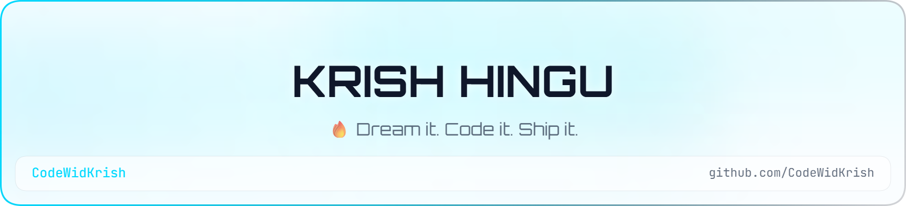

<div align="center">

  <!-- Header Banners (Dark & Light Mode Support) -->
  <picture>
    <source media="(prefers-color-scheme: dark)" srcset="header-dark.png">
    
  </picture>

  <br /><br />

  <!-- Animated Typing SVG -->
  <a href="https://github.com/CodeWidKrish">
    
  </a>

  <p align="center">
    <b>🎓 Computer Engineering Student &nbsp;|&nbsp; 💻 Software Developer &nbsp;|&nbsp; 📍 Mumbai, India</b>
  </p>

  <!-- Connect & Social Badges -->
  <p align="center">
    <a href="https://www.linkedin.com/in/krish-hingu-4575b1333/" target="_blank">
      
    </a>
    <a href="mailto:krishhingu334@gmail.com">
      
    </a>
    <a href="https://github.com/CodeWidKrish" target="_blank">
      
    </a>
    <a href="https://github.com/CodeWidKrish">
      
    </a>
  </p>

</div>

---

### 💫 About Me

```yaml
developer:
  name: Krish Hingu
  education: Computer Engineering Undergraduate
  location: Mumbai, India 🇮🇳
  currently_building: TradeVision AI 📈
  interests: [AI/ML, Mobile App Development, Cloud Technologies, Full-Stack Dev]
  languages_spoken: [English, Hindi, Gujarati, Marathi, German 🌍]
  core_strengths: [Python, Flutter, FastAPI, Data Science, Problem Solving]
```

- 🔭 **Featured Project**: Currently architecting and developing **TradeVision AI** — a cross-platform stock analysis & intelligent forecasting application using **Flutter + FastAPI**.
- 🤝 **Collaboration**: Actively looking to collaborate on open-source **Flutter, Python, and AI/ML** projects.
- 🌱 **Continuous Learning**: Sharpening expertise in **Machine Learning pipelines, Flutter animations, FastAPI microservices, and Supabase BaaS**.
- 💬 **Ask Me About**: Python, Flutter development, Data Analysis with Pandas/NumPy, and Backend APIs.
- ⚡ **Fun Fact**: I can communicate in **5 different languages** (English, Hindi, Gujarati, Marathi & German)! 🌍

---

### 🚀 Highlighted Project

<div align="center">
  <table>
    <tr>
      <td width="600px">
        <h3>📈 TradeVision AI</h3>
        <p>An intelligent, modern stock analysis platform delivering real-time financial tracking, technical indicator visualizations, and predictive market insights.</p>
        <p>
          
          
          
          
          
        </p>
        <p>
          <a href="https://github.com/CodeWidKrish"><b>View Project Repository ➔</b></a>
        </p>
      </td>
    </tr>
  </table>
</div>

---

### 💻 Tech Stack & Toolbelt

<details open>
<summary><b>🛠️ Programming Languages</b></summary>
<br />
<p align="left">
  
  
  
  
  
  
  
  
  
  
  
  
</p>
</details>

<details open>
<summary><b>📱 Mobile, Frameworks & Backend</b></summary>
<br />
<p align="left">
  
  
  
  
</p>
</details>

<details open>
<summary><b>🗄️ Databases</b></summary>
<br />
<p align="left">
  
  
  
  
</p>
</details>

<details open>
<summary><b>🧠 Data Science & Machine Learning</b></summary>
<br />
<p align="left">
  
  
  
  
  
  
  
</p>
</details>

<details open>
<summary><b>🛠️ Tools, Design & Platforms</b></summary>
<br />
<p align="left">
  
  
  
  
  
  
</p>
</details>

---

### 📊 GitHub Activity & Analytics

<div align="center">
  <table border="0">
    <tr>
      <td>
        
      </td>
      <td>
        
      </td>
    </tr>
  </table>

  <br />

  

  <br /><br />

  <!-- Dynamic Activity Contribution Graph -->
  
</div>

---

### 💡 Daily Dev Quote

<div align="center">
  
</div>

<br />

<div align="center">
  <sub>⚡ Designed with passion & precision by <a href="https://github.com/CodeWidKrish">Krish Hingu</a>. Thank you for visiting!</sub>
</div>
